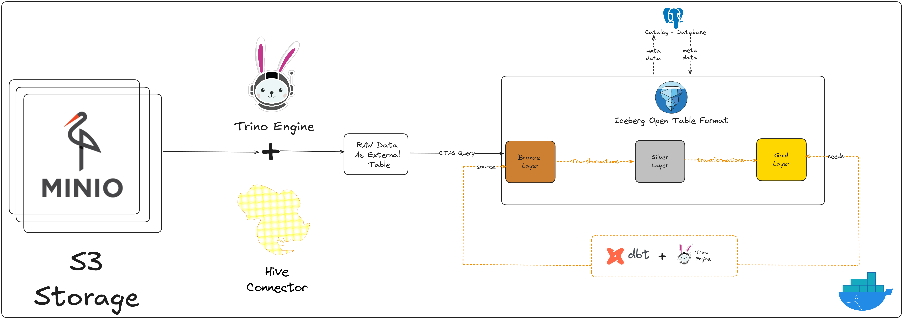

# 🗽 NYC Taxi Lakehouse — Modern End-to-End Data Platform

A complete Lakehouse project built using a modern data engineering stack:

- **MinIO (S3 Object Storage)**
- **Trino Query Engine**
- **Apache Iceberg Open Table Format**
- **PostgreSQL Iceberg Catalog**
- **dbt + dbt-trino**
- **Docker Compose**

The project implements a **Medallion Architecture (Bronze → Silver → Gold)** on the NYC Taxi public dataset, with a strong focus on data modeling, transformation best practices, and query-ready analytics layers.

---

## 🧱 Architecture Overview

<p align="center">
  
</p>

This diagram shows how:

- Raw files are stored in **MinIO** (S3-compatible object storage)
- **Trino** queries data through the **Hive connector** (external raw tables)
- Cleaned and typed data is stored as **Iceberg tables** (Bronze layer)
- **dbt + Trino** apply transformations to build **Silver** and **Gold** layers
- Iceberg metadata is managed in a **PostgreSQL catalog**

---

## 🎯 Project Objectives

This project demonstrates:

- Designing and deploying a **Lakehouse architecture**
- Managing the **raw → structured → analytics** data lifecycle
- Using **Iceberg** for table versioning & performance
- Transformations & modeling with **dbt**
- Building a **Star Schema analytical layer**

It is designed as a **portfolio-grade, real-world data engineering project**.

---

## 🧰 Tech Stack

| Layer           | Technology              |
| --------------- | ----------------------- |
| Object Storage  | MinIO (S3 compatible)   |
| Query Engine    | Trino                   |
| Table Format    | Apache Iceberg          |
| Catalog         | PostgreSQL JDBC Catalog |
| Transformation  | dbt + dbt-trino         |
| Runtime / Infra | Docker Compose          |

---

## 🗂 Project Structure

```text
nyc-taxi-lakehouse/
│
├── docker-compose.yml
├── sql/
│   ├── hive_queries.sql        # External Hive tables on MinIO
│   ├── iceberg_queries.sql     # CTAS → Bronze Iceberg tables
│
├── trino/
│   ├── iceberg.properties
│   └── hive.properties
│
└── dbt/
    ├── nyc_taxi_lakehouse/
    │   ├── models/
    │   │   ├── bronze/
    │   │   ├── silver/
    │   │   ├── gold/
    │   ├── macros/
    │   ├── seeds/
    │   └── dbt_project.yml
    └── profiles.yml
```

---

## 🚀 Running the Platform

### 1️⃣ Start infrastructure

```bash
docker compose up -d
```

Services available:

| Service         | URL                   |
| --------------- | --------------------- |
| MinIO Console   | http://localhost:9001 |
| Trino UI        | http://localhost:8080 |
| Iceberg Catalog | Internal PostgreSQL   |
| dbt environment | via `docker exec`     |

---

### 2️⃣ Upload raw data to MinIO

Upload NYC Taxi CSV files into:

```text
s3://nyc-taxi/raw/yellow_tripdata/2023/
```

You can do this via the MinIO console or any S3-compatible client.

---

### 3️⃣ Create external Hive tables

From the Trino container:

```bash
docker exec -it trino trino -f /sql/hive_queries.sql
```

This will:

- Create the `hive.raw` schema
- Register the raw NYC Taxi CSV files as **external tables**

---

### 4️⃣ Create Bronze Iceberg tables

```bash
docker exec -it trino trino -f /sql/iceberg_queries.sql
```

This will:

- Create the **Iceberg catalog metadata** if needed
- Build the **Bronze** Iceberg tables from the raw external tables using **CTAS**
- Apply schema, typing, and partitioning (e.g., by `year` and `month`)

---

## 🧾 Data Model

### 🟫 Bronze Layer — Typed Storage

The Bronze layer consists of **Iceberg managed tables**:

- Data is cleaned and typed
- Timestamps are standardized
- Tables are **partitioned by year / month**

This layer is optimized for:

- Efficient analytical scans
- Schema enforcement
- Reproducible ingestion

---

### 🟪 Silver Layer — Clean & Enriched Data (dbt)

Silver models are built using **dbt + Trino** on top of the Bronze layer.

Key transformations:

- Filtering out invalid or corrupted records
- Computing **trip duration** in minutes
- Deriving **distance and speed** metrics
- Handling extreme / anomalous values
- Preparing fields for analytical joins

Silver represents a **business-clean** layer and is the main source for the marts.

---

### 🟨 Gold Layer — Star Schema Marts

The Gold layer exposes a **star schema** optimized for BI & analytics.

#### 📌 Dimension Tables

- `dim_date` — calendar attributes (year, month, day, weekday, etc.)
- `dim_time` — time-of-day attributes (hour, minute, time buckets)
- `dim_location` — NYC Taxi zones and boroughs
- `dim_payment_type` — payment methods (from dbt seeds)
- `dim_rate_code` — rate code descriptions (from dbt seeds)

#### 📊 Fact Table — `fact_trips`

Grain: **one row per trip**.

Contains:

- Revenue metrics (fare, tax, tip, total amount, etc.)
- Distance metrics (trip distance in km)
- Time metrics (trip duration, average speed)
- Passenger-related metrics
- Flags such as `is_airport_trip`

A **surrogate key** is generated using a custom dbt macro to ensure a stable and unique trip identifier.

---

## 🧪 Data Quality & Testing

Data quality is enforced using **dbt tests**:

- `not_null` on critical metrics and keys
- `unique` on primary keys (e.g., fact and dimension IDs)
- `relationships` between fact and dimension tables
- `accepted_values` on categorical fields (e.g., payment type, rate code)

These tests help keep the analytical layer **trustworthy and consistent**.

---

## 🧠 Why This Project Matters

This project showcases:

- Clear separation of **storage / compute / metadata**
- Practical **Lakehouse ingestion patterns**
- Modern **Medallion architecture** (Bronze / Silver / Gold)
- An **Iceberg-based** table layer with partitions
- An analytics-ready **star schema** modeled with dbt
- Data governance and quality using **dbt testing**

It demonstrates **production-style data engineering thinking**, from raw files to analytics-ready tables.

---

## 🚀 Future Improvements (Roadmap)

Potential extensions:

- Automated ingestion pipelines (e.g., Airflow / Mage)
- Dashboard layer using Superset / Metabase / Power BI
- Time-travel and rollback demos using Iceberg snapshots
- Incremental models loads

---

## 👤 Author

**Lotfi Mayouf**  
Data Engineering & MLOps enthusiast

- 🔗 GitHub: https://github.com/lotfimay
- 🔗 LinkedIn: https://www.linkedin.com/in/lotfi-mayouf-714932226/
